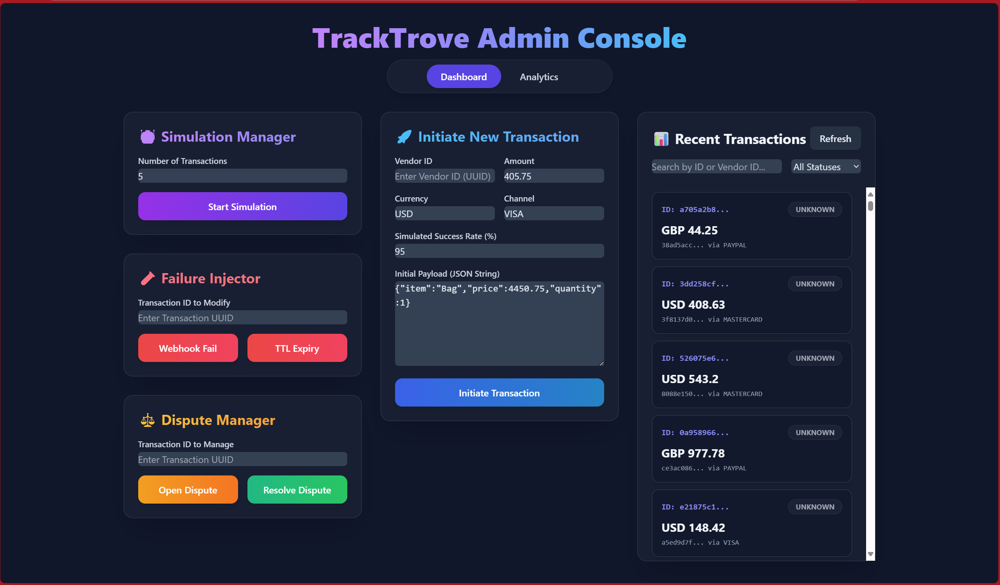

# TrackTrove Frontend

A **React 19 + Vite** powered admin console for:

- Visualizing transaction flows  
- Injecting failures  
- Managing disputes  
- Exploring interactive analytics  



---

## Table of Contents

- [Features](#features)  
- [Tech Stack](#tech-stack)  
- [Prerequisites](#prerequisites)  
- [Installation](#installation)  
- [Development, Structure, & Contribution](#-development-structure--contribution)

---

## Features

- **Simulation Manager** – Fire off bulk transactions with random payloads  
- **Transaction Initiator** – UUID validation with JSON payload editor  
- **Failure Injector** – Test webhook timeouts or TTL expiry  
- **Dispute Manager** – Open and resolve disputes  
- **Transaction Feed** – Search, filter by status, and explore details  
- **Timeline Modal** – Animated transaction flow with real-time progress  
- **Interactive Analytics** – Bar, pie, and line charts for transaction insights  
- **Responsive UI** – Built with Tailwind CSS and reusable components  

---

## Tech Stack

- React 19 + Vite  
- Tailwind CSS (with custom themes)  
- Recharts (data visualizations)  
- Moment.js (date formatting)  
- Fetch API (backend communication)  
- UUID utility (for testing flows)  

---

## Prerequisites

- **Node.js** v16+  
- **npm** v8+ (or **yarn**)  
- Running TrackTrove backend at `http://localhost:8080`
- git clone <https://github.com/AnkitV15/tracktrove-backend.git>  

---

## Installation

```bash
git clone https://github.com/AnkitV15/tracktrove-frontend.git
cd tracktrove-frontend
npm install
```

---

## Development, Structure, & Contribution

### Scripts

```bash
# Start development server
npm run dev

# Build for production
npm run build

# Preview production build
npm run preview
```

### Environment Setup

Create a `.env.local` file in the root of the project:

```env
VITE_API_BASE_URL=http://localhost:8080/api
```

> If not set, it defaults to `http://localhost:8080/api`.

### Project Structure

```bash
docs/
└─ dashboard.png         # Replace with your actual dashboard screenshot

src/
├─ components/
│  ├─ AdminDashboard.jsx
├─ index.css
├─ main.jsx
└─ tailwind.config.js
```

### Contribution Guidelines

1. Fork the repository  
2. Create a new branch: `git checkout -b feature/YourFeature`  
3. Commit your changes: `git commit -m "Add feature"`  
4. Push your changes: `git push origin feature/YourFeature`  
5. Open a Pull Request

### License

This project is open-source and available under the [MIT License](LICENSE).
